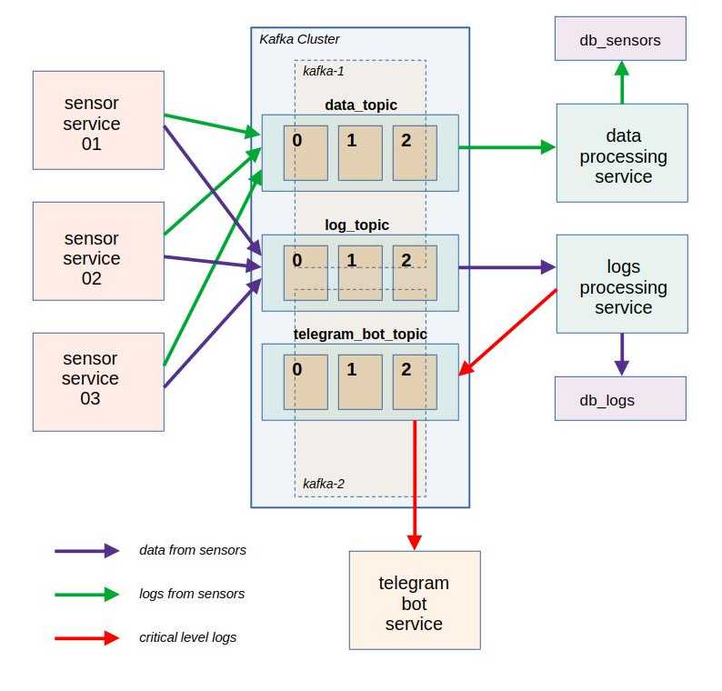

## Kafka microservices training

### Учебный проект по взаимодействию микросервисов через Apache Kafka

### Архитектура проекта

- Три сервиса-продьюсера. Имитируют работу сенсоров:
    - периодически генерируют и отправляют боркеру данные о своей работе;
    - со случайной периодичностью генерируют логи;
    - логи имеют случайный уровень важности.
- Два сервиса-консьюмера:
    - Сервис обработки данных. Получает данные из брокера и сохраняет в БД;
    - Сервис обработки логов. Принимает логи и сохраняет их в БД;
    - Логи уровня "CRITICAL" направляются в брокер для передачи в сервис телеграм-бота.
- Сервис телеграм-бота:
    - Принимает логи уровня "CRITICAL" и отправляет сообщение пользователю телеграм-бота.

#### При разработке проекта применены следующие технологии:
- Python v3.12
- Fastapi v0.111
- Kafka-python v2.0.3.dev0
- fFastavro v1.9
- SQLAlchemy v2.0

#### Комментарии к развертыванию проекта

- Поскольку имитируется независимая работа микросервисов, каждый сервис расположен в отдельной директории.
- Файл requirements_common.txt содержит все зависимости, позволяет развернуть общее окружение для всех сервисов.
    - Внимание! Сервис телеграм-бота в общем окружении не запустится, т.к. использует python версии 3.9
- Сервис запускается через Docker compose:
    - Находясь в дироектории проекта, выполнить команду:
        - `docker compose up`
    - После запуска проекта API сервисов-продьюсеров будет доступно по адресам:
        - `http://127.0.0.1:8000/docs/`
        - `http://127.0.0.1:9000/docs/`
        - `http://127.0.0.1:10000/docs/`
    - Обращением к эндпойнтам "/start" и "/stop" можно начинать и заканчивать генерацию сообщений.
    - БД сенсоров будет доступна по адресу `localhost:5432`.
    - БД логов будет доступна по адресу `localhost:5433`.
    - Телеграм-бот доступен по адресу @wake_lift_testing_bot.
